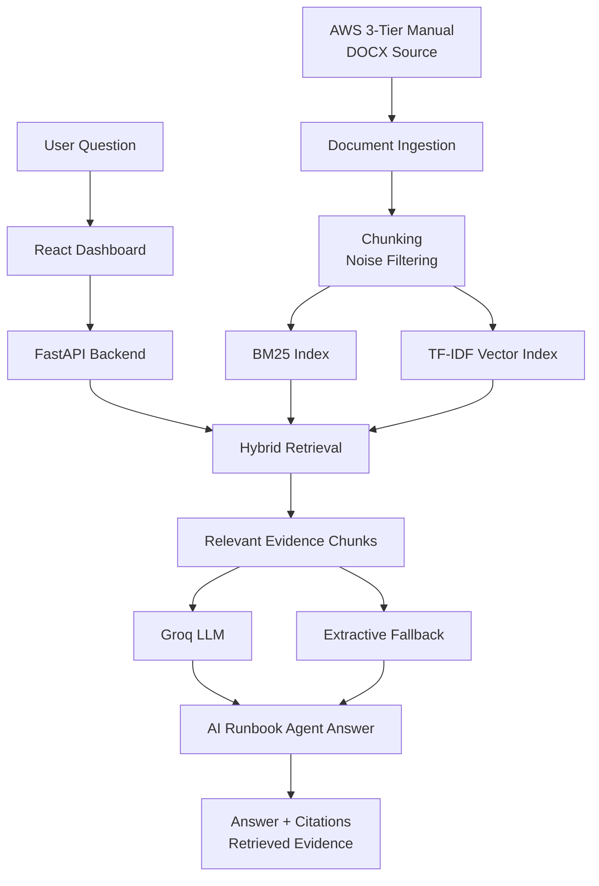
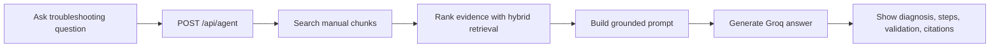

# AWS 3-Tier Runbook AI Agent

**언어:** [English](./README.md) | 한국어

FastAPI와 Groq LLM 기반의 **RAG-powered AI Runbook Agent**입니다. AWS 3-tier 아키텍처 구축 문서를 검색 가능한 technical knowledge base로 변환하고, 질문에 맞는 근거 chunk를 검색한 뒤 장애 진단 절차와 검증 기준을 생성합니다.

## Demo

- Live Demo: [Hugging Face Space](https://huggingface.co/spaces/onekindalpha/aws-3tier-runbook-ai-agent)

https://github.com/user-attachments/assets/8797e252-1eb6-4ade-b611-26c94fec59a4

---

이 프로젝트는 static AWS 3-tier architecture manual을 searchable runbook assistant와 Groq-powered RAG agent로 확장한 것입니다. 원본 technical documentation에서 evidence를 검색하고 network, security, web/API, database configuration issue에 대한 grounded troubleshooting step을 생성합니다.

> Scope note: 이 프로젝트는 AWS resource를 직접 수정하는 autonomous agent가 아니라 **RAG-powered runbook agent**입니다. AWS Console을 직접 클릭하거나 resource setting을 변경하지 않습니다.

---

## What It Does

이 프로젝트는 AWS 3-tier architecture 운영을 위한 AI-assisted technical runbook입니다.

사용자는 다음 내용을 확인할 수 있습니다.

- 어떤 AWS menu 또는 configuration area를 먼저 점검해야 하는지
- VPC, Subnet, Route Table, NACL, Security Group, ALB, Web Tier, API Tier, RDS가 어떻게 연결되는지
- tier 간 traffic flow가 막힐 때 무엇을 검증해야 하는지
- 생성된 답변을 뒷받침하는 retrieved manual chunk가 무엇인지
- source documentation 기반 troubleshooting step을 어떻게 구성할 수 있는지

목표는 AWS Console operation을 대체하는 것이 아니라, searchable context, citation, LLM-generated runbook step으로 documentation-based troubleshooting을 지원하는 것입니다.

---

## Key Features

- AWS 3-tier runbook dashboard
- React-based technical documentation UI
- FastAPI backend
- DOCX manual ingestion
- Chunk-based document indexing
- BM25 lexical retrieval
- TF-IDF vector retrieval
- BM25 + TF-IDF hybrid retrieval scoring
- Groq LLM grounded answer generation
- `/api/search` evidence retrieval endpoint
- `/api/ask` grounded answer endpoint
- `/api/agent` RAG-powered runbook agent endpoint
- Retrieval evaluation endpoint
- Query logging
- LLM fallback mode
- Docker backend configuration
- Separate frontend/backend local development setup
- Security-safe API key handling through backend environment variables

---

## Architecture

---

## System Flow

---

## Service Pages

| Page | Purpose |
|---|---|
| Overview | Project summary and runbook positioning |
| Manual Runbook | High-level AWS 3-tier setup flow |
| Network | VPC, Subnet, Route Table, Internet Gateway, NAT Gateway notes |
| Security | NACL and Security Group troubleshooting focus |
| Web/API/DB | ALB, Web Tier, API Tier, RDS connection flow |
| Validation | Verification checklist after configuration |
| Document Search | Evidence search and grounded answer generation |
| AI Agent | Groq-based RAG runbook agent for troubleshooting |

---

## Implementation Notes

- **Retrieval-first design**: user question을 바로 LLM에 보내지 않고, 먼저 관련 manual chunk를 검색합니다.
- **Hybrid retrieval**: BM25는 AWS resource name과 exact technical term에 강하고, TF-IDF cosine retrieval은 broader natural-language matching을 보완합니다.
- **Grounded generation**: retrieved chunk를 prompt에 포함해 LLM answer를 source evidence에 제한합니다.
- **Citation UI**: 답변은 chunk ID, section, page, retrieved evidence를 함께 제공합니다.
- **Fallback design**: `GROQ_API_KEY`가 없거나 LLM generation이 실패하면 retrieved chunk 기반 extractive answer를 반환합니다.
- **Agent scope**: agent는 diagnosis와 verification step을 생성하지만 AWS action을 실행하지 않습니다.

---

## Development Notes

Project structure, local setup, API examples, environment variables, Docker backend usage, security note는 [DEVELOPMENT.md](./DEVELOPMENT.md)에 분리했습니다.

---

## Portfolio Context

이 레포는 **AI service / backend / RAG agent portfolio project**로 포지셔닝합니다.

보여주는 역량은 다음과 같습니다.

- static technical manual을 searchable knowledge base로 변환
- FastAPI 기반 RAG endpoint 구현
- lexical retrieval과 vector retrieval 결합
- Groq LLM을 활용한 grounded troubleshooting answer 생성
- frontend UI, backend API, document ingestion, retrieval, agent logic 분리
- backend environment variable을 통한 API key handling
- deployable AI documentation assistant 설계

---

## Honest Scope

이 프로젝트는 다음을 수행합니다.

- 관련 AWS manual chunk 검색
- grounded troubleshooting step 생성
- citation과 retrieved evidence 표시
- FastAPI 기반 document search와 agent workflow 제공

하지 않는 것:

- AWS resource 직접 제어
- VPC, EC2, ALB, RDS, Security Group setting 수정
- IAM-governed automation 대체
- source document quality review 없이 correctness 보장
