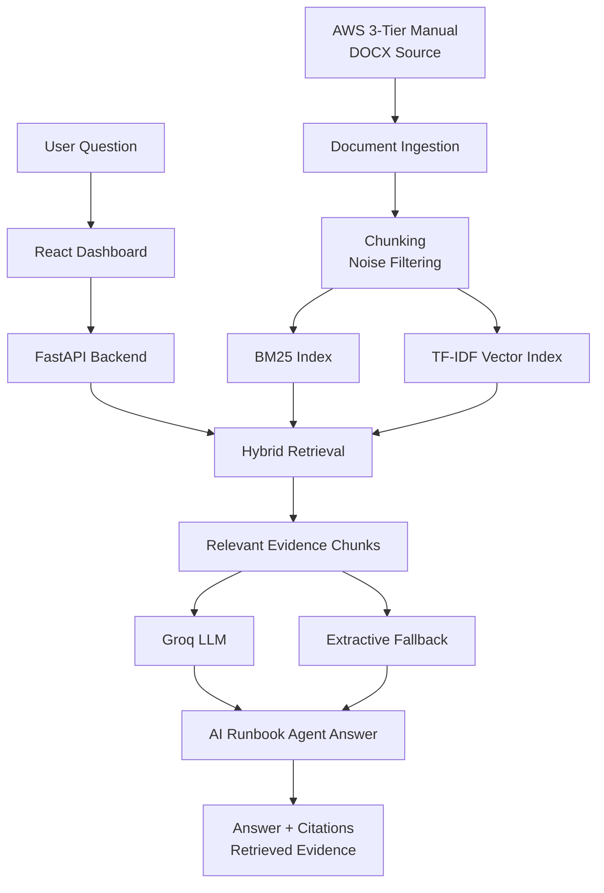

# AWS 3-Tier Runbook AI Agent

**Language:** English | [한국어](./README.ko.md)

FastAPI와 Groq LLM 기반의 **RAG-powered AI Runbook Agent**입니다.  
AWS 3-tier 아키텍처 구축 문서를 검색 가능한 technical knowledge base로 변환하고, 질문에 맞는 근거 chunk를 검색한 뒤 장애 진단 절차와 검증 기준을 생성합니다.

## Demo

- Live Demo: [Hugging Face Space](https://huggingface.co/spaces/onekindalpha/aws-3tier-runbook-ai-agent)

https://github.com/user-attachments/assets/8797e252-1eb6-4ade-b611-26c94fec59a4

--- 

This project extends a static AWS 3-tier architecture manual into a searchable runbook assistant and Groq-powered RAG agent. It retrieves evidence from the original technical documentation and generates grounded troubleshooting steps for network, security, web/API, and database configuration issues.

> Scope note: this is a **RAG-powered runbook agent**, not an autonomous AWS resource-modifying agent. It does not directly click the AWS Console or change AWS resources.

---

## What It Does

This project works as an AI-assisted technical runbook for AWS 3-tier architecture operations.

It helps users check:

- which AWS menu or configuration area to inspect first
- how VPC, Subnet, Route Table, NACL, Security Group, ALB, Web Tier, API Tier, and RDS are connected
- what to verify when traffic does not flow across tiers
- which retrieved manual chunks support a generated answer
- how to create troubleshooting steps from source documentation rather than free-form hallucination

The goal is not to replace AWS Console operations, but to support documentation-based troubleshooting with searchable context, citations, and LLM-generated runbook steps.

---

## Key Features

- AWS 3-tier runbook dashboard
- React-based technical documentation UI
- FastAPI backend
- DOCX manual ingestion
- Chunk-based document indexing
- BM25 lexical retrieval
- TF-IDF vector retrieval
- BM25 + TF-IDF hybrid retrieval scoring
- Groq LLM grounded answer generation
- `/api/search` evidence retrieval endpoint
- `/api/ask` grounded answer endpoint
- `/api/agent` RAG-powered runbook agent endpoint
- Retrieval evaluation endpoint
- Query logging
- LLM fallback mode when API key is unavailable
- Docker backend configuration
- Separate frontend/backend local development setup
- Security-safe API key handling through backend environment variables

---

## Architecture

---

## System Flow

---

## Service Pages

| Page | Purpose |
|---|---|
| Overview | Project summary and runbook positioning |
| Manual Runbook | High-level AWS 3-tier setup flow |
| Network | VPC, Subnet, Route Table, Internet Gateway, NAT Gateway notes |
| Security | NACL and Security Group troubleshooting focus |
| Web/API/DB | ALB, Web Tier, API Tier, and RDS connection flow |
| Validation | Verification checklist after configuration |
| Document Search | Evidence search and grounded answer generation |
| AI Agent | Groq-based RAG runbook agent for troubleshooting |

---

## Implementation Notes

- **Retrieval-first design**: user questions are not sent directly to the LLM. The backend first retrieves relevant manual chunks.
- **Hybrid retrieval**: BM25 captures AWS resource names and exact technical terms, while TF-IDF cosine retrieval supports broader natural-language matching.
- **Grounded generation**: retrieved chunks are inserted into the prompt so the LLM answer is constrained by source evidence.
- **Citation UI**: returned answers include chunk IDs, sections, pages, and retrieved evidence.
- **Fallback design**: if `GROQ_API_KEY` is unavailable or LLM generation fails, the backend returns an extractive answer from retrieved chunks.
- **Agent scope**: the agent generates diagnosis and verification steps. It does not execute AWS actions.
- **Operational UX**: the dashboard separates runbook reading, evidence search, and agent-based troubleshooting.

---

## Tech Stack

- Frontend: React, Vite, JavaScript, CSS
- Backend: FastAPI, Uvicorn, Pydantic
- Document processing: `python-docx`
- Retrieval: custom chunking, BM25, TF-IDF, hybrid scoring
- LLM: Groq API through OpenAI-compatible client
- Evaluation: retrieval evaluation endpoint
- Logging: JSONL query logs
- Deployment setup: Docker backend, Docker Compose
- Source control: GitHub

---

## Development Notes

Project structure, local setup, API examples, environment variables, Docker backend usage, and security notes are separated into [DEVELOPMENT.md](./DEVELOPMENT.md).

---

## Portfolio Context

This repository is positioned as an **AI service / backend / RAG agent portfolio project**.

It shows:

- converting a static technical manual into a searchable knowledge base
- implementing FastAPI-based RAG endpoints
- combining lexical and vector retrieval
- generating grounded troubleshooting answers with Groq LLM
- separating frontend UI, backend API, document ingestion, retrieval, and agent logic
- handling API keys through backend environment variables
- designing the project as a deployable AI documentation assistant

This project can be connected with other AI/backend portfolio work:

- Battery RUL AI Inference System: model inference, dashboard, API, deployment
- Battery Technical Document RAG: technical document search and grounded answer generation
- AWS 3-Tier Runbook AI Agent: infrastructure documentation, troubleshooting, and runbook automation support

---

## Honest Scope

This project is a **RAG-powered AI Runbook Agent**.

It does:

- retrieve relevant AWS manual chunks
- generate grounded troubleshooting steps
- show citations and retrieved evidence
- support FastAPI-based document search and agent workflows

It does not:

- directly control AWS resources
- modify VPC, EC2, ALB, RDS, or Security Group settings
- replace IAM-governed automation
- guarantee correctness without source document quality review
