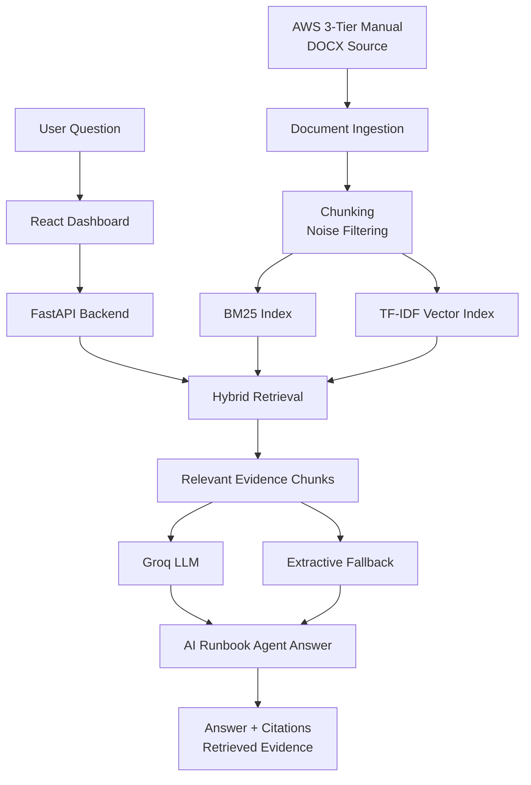

# AWS 3-Tier Runbook AI Agent

## Demo

**Live Demo**: [(https://huggingface.co/spaces/onekindalpha/aws-3tier-runbook-ai-agent)]

--- 

FastAPI와 Groq LLM 기반의 **RAG-powered AI Runbook Agent**입니다.  
AWS 3-tier 아키텍처 구축 문서를 검색 가능한 technical knowledge base로 변환하고, 질문에 맞는 근거 chunk를 검색한 뒤 장애 진단 절차와 검증 기준을 생성합니다.

This project extends a static AWS 3-tier architecture manual into a searchable runbook assistant and Groq-powered RAG agent. It retrieves evidence from the original technical documentation and generates grounded troubleshooting steps for network, security, web/API, and database configuration issues.

> Scope note: this is a **RAG-powered runbook agent**, not an autonomous AWS resource-modifying agent. It does not directly click the AWS Console or change AWS resources.

---

## What It Does

This project works as an AI-assisted technical runbook for AWS 3-tier architecture operations.

It helps users check:

- which AWS menu or configuration area to inspect first
- how VPC, Subnet, Route Table, NACL, Security Group, ALB, Web Tier, API Tier, and RDS are connected
- what to verify when traffic does not flow across tiers
- which retrieved manual chunks support a generated answer
- how to create troubleshooting steps from source documentation rather than free-form hallucination

The goal is not to replace AWS Console operations, but to support documentation-based troubleshooting with searchable context, citations, and LLM-generated runbook steps.

---

## Key Features

- AWS 3-tier runbook dashboard
- React-based technical documentation UI
- FastAPI backend
- DOCX manual ingestion
- Chunk-based document indexing
- BM25 lexical retrieval
- TF-IDF vector retrieval
- BM25 + TF-IDF hybrid retrieval scoring
- Groq LLM grounded answer generation
- `/api/search` evidence retrieval endpoint
- `/api/ask` grounded answer endpoint
- `/api/agent` RAG-powered runbook agent endpoint
- Retrieval evaluation endpoint
- Query logging
- LLM fallback mode when API key is unavailable
- Docker backend configuration
- Separate frontend/backend local development setup
- Security-safe API key handling through backend environment variables

---

## Architecture



---

## System Flow


---

## Service Pages

| Page | Purpose |
|---|---|
| Overview | Project summary and runbook positioning |
| Manual Runbook | High-level AWS 3-tier setup flow |
| Network | VPC, Subnet, Route Table, Internet Gateway, NAT Gateway notes |
| Security | NACL and Security Group troubleshooting focus |
| Web/API/DB | ALB, Web Tier, API Tier, and RDS connection flow |
| Validation | Verification checklist after configuration |
| Document Search | Evidence search and grounded answer generation |
| AI Agent | Groq-based RAG runbook agent for troubleshooting |

---

## Implementation Notes

- **Retrieval-first design**: user questions are not sent directly to the LLM. The backend first retrieves relevant manual chunks.
- **Hybrid retrieval**: BM25 captures AWS resource names and exact technical terms, while TF-IDF cosine retrieval supports broader natural-language matching.
- **Grounded generation**: retrieved chunks are inserted into the prompt so the LLM answer is constrained by source evidence.
- **Citation UI**: returned answers include chunk IDs, sections, pages, and retrieved evidence.
- **Fallback design**: if `GROQ_API_KEY` is unavailable or LLM generation fails, the backend returns an extractive answer from retrieved chunks.
- **Agent scope**: the agent generates diagnosis and verification steps. It does not execute AWS actions.
- **Operational UX**: the dashboard separates runbook reading, evidence search, and agent-based troubleshooting.

---

## Tech Stack

- Frontend: React, Vite, JavaScript, CSS
- Backend: FastAPI, Uvicorn, Pydantic
- Document processing: `python-docx`
- Retrieval: custom chunking, BM25, TF-IDF, hybrid scoring
- LLM: Groq API through OpenAI-compatible client
- Evaluation: retrieval evaluation endpoint
- Logging: JSONL query logs
- Deployment setup: Docker backend, Docker Compose
- Source control: GitHub

---

## Project Structure

```text
.
├── backend/
│   ├── app/
│   │   ├── main.py          # FastAPI endpoints
│   │   ├── ingest.py        # DOCX ingestion and chunking
│   │   ├── retriever.py     # BM25 + TF-IDF hybrid retrieval
│   │   ├── prompt.py        # grounded answer prompt/fallback
│   │   ├── agent.py         # Groq RAG runbook agent
│   │   ├── evaluator.py     # retrieval evaluation
│   │   ├── schemas.py
│   │   └── config.py
│   └── requirements.txt
├── docs/
│   └── aws_3tier_manual_ver4.1.0.docx
├── src/
│   ├── components/
│   └── data/
├── public/
├── Dockerfile.backend
├── docker-compose.yml
└── README.md
```

---

## Run Locally

### 1. Backend

```bash
cd ~/aws-3tier-architecture-docs

python3 -m venv backend/.venv
source backend/.venv/bin/activate

python -m pip install --upgrade pip
python -m pip install -r backend/requirements.txt
```

Run without LLM generation:

```bash
python -m uvicorn backend.app.main:app --reload --host 0.0.0.0 --port 8000
```

Run with Groq:

```bash
export ALLOW_LLM=true
export LLM_PROVIDER=groq
export GROQ_API_KEY="your-groq-api-key"
export GROQ_MODEL="llama-3.1-8b-instant"

python -m uvicorn backend.app.main:app --reload --host 0.0.0.0 --port 8000
```

### 2. Frontend

Open another terminal:

```bash
cd ~/aws-3tier-architecture-docs
npm install
VITE_RAG_API_BASE=http://127.0.0.1:8000 npm run dev -- --force
```

Open:

```text
http://localhost:5173/aws-3tier-architecture-docs/
```

---

## API

### Health

```bash
curl http://127.0.0.1:8000/api/health
```

### Search Evidence

```bash
curl -X POST http://127.0.0.1:8000/api/search \
  -H "Content-Type: application/json" \
  -d '{"query":"Flask NACL inbound", "top_k":5}'
```

### Ask with Evidence

```bash
curl -X POST http://127.0.0.1:8000/api/ask \
  -H "Content-Type: application/json" \
  -d '{"query":"RDS 접근이 안 될 때 무엇을 확인해야 해?", "top_k":5, "use_llm":true}'
```

### Run AI Agent

```bash
curl -X POST http://127.0.0.1:8000/api/agent \
  -H "Content-Type: application/json" \
  -d '{"question":"ALB target group이 unhealthy면 어떤 순서로 봐야 해?", "top_k":6, "mode":"diagnose"}'
```

### Retrieval Evaluation

```bash
curl -X POST http://127.0.0.1:8000/api/eval \
  -H "Content-Type: application/json" \
  -d '{
    "top_k": 5,
    "cases": [
      {
        "query": "RDS 접근이 안 될 때 확인할 항목",
        "expected_terms": ["RDS"]
      }
    ]
  }'
```

Interactive API docs:

```text
http://127.0.0.1:8000/docs
```

---

## Environment Variables

| Variable | Description |
|---|---|
| `ALLOW_LLM` | Enables LLM generation when set to `true` |
| `LLM_PROVIDER` | `groq`, `openai`, `auto`, or `none` |
| `GROQ_API_KEY` | Groq API key. Do not commit this value |
| `GROQ_MODEL` | Groq chat model identifier |
| `GROQ_BASE_URL` | OpenAI-compatible Groq base URL |
| `OPENAI_API_KEY` | Optional OpenAI API key |
| `OPENAI_MODEL` | Optional OpenAI model name |
| `TOP_K_DEFAULT` | Default number of retrieved chunks |

---

## Docker Backend

```bash
docker compose up --build rag-backend
```

Backend API:

```text
http://127.0.0.1:8000
```

---

## Portfolio Context

This repository is positioned as an **AI service / backend / RAG agent portfolio project**.

It shows:

- converting a static technical manual into a searchable knowledge base
- implementing FastAPI-based RAG endpoints
- combining lexical and vector retrieval
- generating grounded troubleshooting answers with Groq LLM
- separating frontend UI, backend API, document ingestion, retrieval, and agent logic
- handling API keys through backend environment variables
- designing the project as a deployable AI documentation assistant

This project can be connected with other AI/backend portfolio work:

- Battery RUL AI Inference System: model inference, dashboard, API, deployment
- Battery Technical Document RAG: technical document search and grounded answer generation
- AWS 3-Tier Runbook AI Agent: infrastructure documentation, troubleshooting, and runbook automation support

---

## Security Note

Do not commit API keys.

Use local shell environment variables, `.env`, GitHub Secrets, or deployment platform secrets.

```bash
export GROQ_API_KEY="your-key"
```

Never put real API keys in:

- `README.md`
- frontend code
- committed `.env`
- screenshots
- issue comments

---

## Honest Scope

This project is a **RAG-powered AI Runbook Agent**.

It does:

- retrieve relevant AWS manual chunks
- generate grounded troubleshooting steps
- show citations and retrieved evidence
- support FastAPI-based document search and agent workflows

It does not:

- directly control AWS resources
- modify VPC, EC2, ALB, RDS, or Security Group settings
- replace IAM-governed automation
- guarantee correctness without source document quality review

